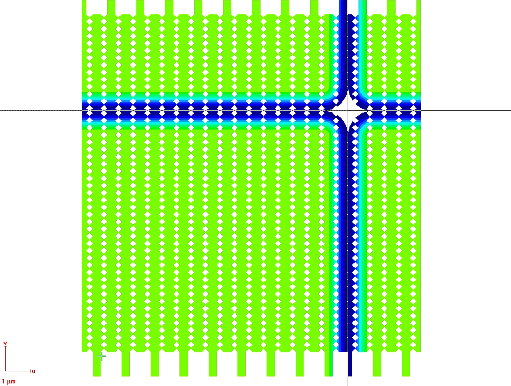

# stitchy
python script to generate gds files for stitching error free writing on raith eline systems


## Working principle
By default the raith software partitions the polygons in the gdsii files into squares and writes those on the sample by moving this stage. This however creates gaps and errors between these writefields. To circumvent this, one can artificially enlarge the patterned fields, so they overlap. Then the design is modified so that the edge is a dose gradient.

## How to use
Install the the neccesary libraries with `pip install numpy gdspy`
Then process your gds file to generate the dose scaling:
```python .\stitchy.py -i .\inputfile.gds -w 100 -c [10,10] -o .\outputfile.gds```

After doing the writefield alignment, manually set the zoom u,v settings to 1.02 and send them to the patterning controller. Make sure that the writefield is correctely aligned with the manual stitching in the gdsii file. Also check that the ebl tool can go high enough with the beam speed to write the low dose areas correctely.

## Example image of the generated polygons with dose falloff

